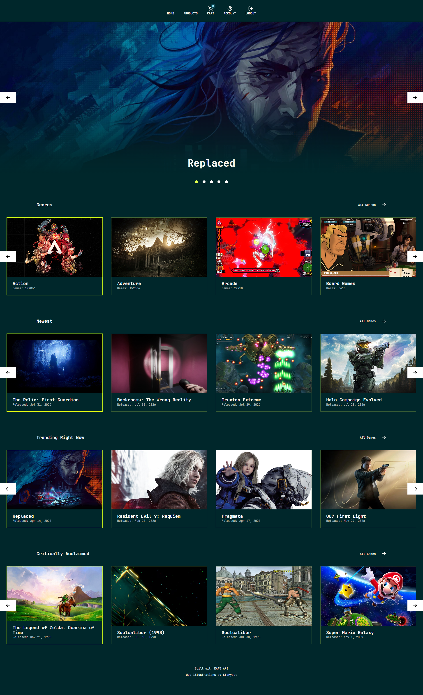
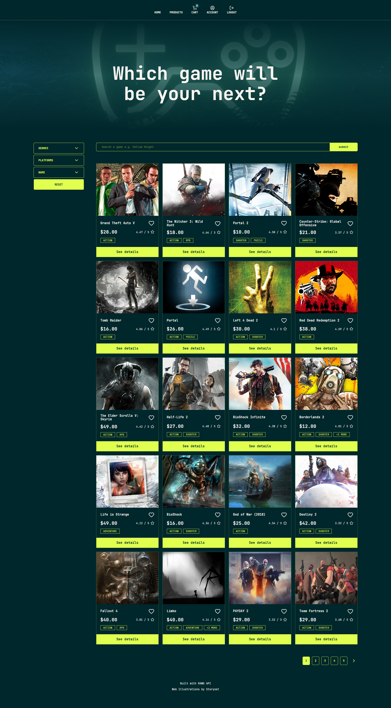
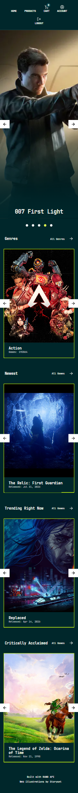
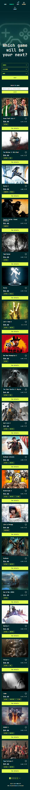

# About

This project is a video game store SPA. It fetches game data from RAWG API.

## Table of Contents

- [Features](#features)
- [Screenshots](#screenshots)
- [Links](#links)
- [Project Structure](#project-structure)
- [Technologies Used](#technologies-used)
- [Known Limitations]
- [Getting Started](#getting-started)
- [Credits](#credits)

## Features

Users have access to the following features and functionalites:

- **Home Page with Infinite Carousels** - featuring different categories of games; the carousels are accessible and support keyboard navigation
- **Product Search** - search for games in the games catalog by entering a game name in the seach bar on the Products page
- **Product Filtering** - filter game catalog
- **Pagination** - navigate pages of games in the catalog
- **Lightbox** - display the image gallery on product pages in a lightbox (modal with the gallery) for better viewing experience
- **Login** - log in to access any created wishlists and placed orders
- **Authentication** - via magic link powered by Supabase
- **Wishlist Functionality** - once logged in, create wishlists that are stored in Supabase
- **Cart**:
  - adding and removing items functionality
  - clear cart functionality
  - total price calculation per-item and for the whole cart
- **Orders** - once logged in place an order for items in the cart - this means storing order data in Supabase, NO PURCHASES ARE MADE
- **Product Pages** - view details of games, such as rating, price, platforms, description, gallery and system requiremenst

## Screenshots

## Links

- Solution URL: [GitHub](https://github.com/ania221B/video-game-store)
- Live Site URL: [Netlify](https://good-gamez.netlify.app)

## Project Structure

📁 src/

├── api/                      # Data fetching functions & queries

├── app/                      # RTK store

├── assets/                      # Images & fonts

|  ├── images/

|  └── fonts/

├── components/                  # Shared UI and feature components

│  ├── common/                    # Generic, cross-project components (e.g. Button, Breadcrumb)

│  ├── layout/                    # Layout-related components (e.g. Header, Footer)

│  ├── lists/                     # Reusable list-related components

│  ├── sections/                  # Page-specific or grouped content sections

│  └── ui/                        # Small building blocks (e.g. CartItem, ProductCard)

├── sass/                        # SCSS partials and global styles

│ ├── abstracts/                # Variables, mixins, functions

│ ├── base/                      # Reset, general styles

│ ├── components/                # Elements with their own styles, like buttons, inputs, cards, etc.

│ ├── layout/                    # Generic styling creating layouts

│ ├── utilities/                 # Classes that do one specific thing

│ └── vendor/                    # Third party CSS

├── utils                      # Utility functions

├── App.jsx                      # Top-level UI component

├── index.scss                   # Entry point that imports all styles

├── main.jsx                   # Entry point that imports all styles

└── router.jsx                     # Set up of routes and suspense boundaries

## Technologies Used

- React.js
- Redux Toolkit
- React Router DOM
- TanStack Query/React Query
- React Suspense
- Supabase
- Semantic HTML 5 Markup
- CSS Grid
- Flexbox
- SCSS

## Known Linitations

- **RAWG API rate limits apply**
- **RAWG images are large and unoptimized**. Not much I can do about this since I don't control them.
- **RAWG data is not consistent**.
  - Sometimes game descriptions are in English and another language, like Spanish.
  - System requiremtens data does not have consistent shape, hence there are cases where minimum and recommended requirements are mixed.
  - Some of the data is missing, this means there is no fully reliable way to filter out NSFW content. This is why additional measures (utility functions) were put in place, yet due to missing data these aren't foolproof either.
- **RAWG doesn't provide price data**. Prices shown are derived using game ids.
- **No payment processing demo**. Placing an order means storing in in Subabase. The order can then be displayed on user account page under orders. There is no screen for providing dummy payment data.

## Getting Started

1. Clone the repo
2. Run `npm install`
3. Create a `.env` file with:
   - `VITE_SUPABASE_URL`
   - `VITE_SUPABASE_PUBLISHABLE_KEY`
   - `VITE_RAWG_API_KEY`
4. Run `npm run dev`

## Credits

- This solution was made using a template I build while taking [Beyond CSS](https://www.beyondcss.dev/) course by [Kevin Powell](https://www.kevinpowell.co/). You can find Kevin's template on [his GitHub](https://github.com/kevin-powell)
- Game data powered by [RAWG API](https://rawg.io/apidocs).
- Icons provided by [Lucide](https://lucide.dev)
- Illustration used for Error component provided by [Storyset](https://storyset.com/web)

---
